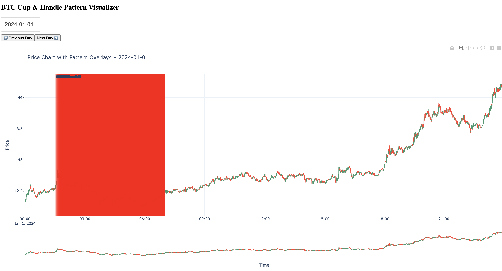

````markdown
# 📊 Crypto Market Pattern Detection (BTCUSDT - Binance 1m)

A hybrid **Rule-Based + Machine Learning** system to detect **Cup & Handle** patterns in crypto market data. Uses Binance 1-minute candles and visualizes detected patterns via a Dash dashboard.

---

## 🚀 Getting Started

### 1️⃣ Download & Merge Binance Data

```bash
python download_and_merge.py
````

* Downloads 1-minute BTCUSDT data using Binance API
* Merges raw CSV files into:

```
data/market-data/raw/binance_1m.csv
```

---

### 2️⃣ Run the Detection + ML Pipeline

```bash
python main.py
```

Performs:

* ✅ Rule-based pattern detection
* ✅ Auto-labeling
* ✅ Feature extraction
* ✅ Model training (or fallback)
* ✅ ML confidence scoring
* ✅ PNG chart generation

Outputs:

* `report_rule.csv`: Rule-only patterns
* `report_ml.csv`: ML-enhanced patterns
* `.png` charts in `data/market-data/processed/pattern-charts/`

---

| Path                                                               | Description                                                                                                                           |
| ------------------------------------------------------------------ | ------------------------------------------------------------------------------------------------------------------------------------- |
| `data/market-data/processed/doc/report_rule.csv`                   | ✅ Contains **rule-based detected patterns**. Each row has start/end timestamps, depth, duration, r², and invalidation reason if any.  |
| `data/market-data/processed/doc/report_ml.csv`                     | ✅ Contains **ML-enhanced pattern analysis**. Same as above but includes `ml_confidence` and `ml_valid` fields.                        |
| `data/market-data/processed/doc/pattern_features_for_labeling.csv` | 🧠 Extracted features for each detected pattern, used for ML training. Also includes auto-generated label (0 or 1).                   |
| `data/market-data/model/pattern_sgd_model.pkl`                     | 🤖 Trained ML model bundle, including the `SGDClassifier` and its `StandardScaler`. Loaded or updated each time you run the pipeline. |
| `data/market-data/processed/pattern-charts/cup_handle_*.png`       | 📉 PNG charts of **rule-based valid patterns** (named `cup_handle_1.png`, `cup_handle_2.png`, etc.).                                  |
| `data/market-data/processed/pattern-charts/ml_cup_handle_*.png`    | 📈 PNG charts of **ML-validated patterns** only, with high confidence. (named `ml_cup_handle_1.png`, etc.)                            |


### 3️⃣ Launch Interactive Dashboard

```bash
python app.py
```

* Browse price + patterns by day
* 🟥 Red overlays: Rule-based patterns
* 🟩 Green overlays: ML-validated patterns

### Dashboard

---

## 🧠 Machine Learning Details

* Model: `SGDClassifier` (log-loss)
* Features extracted from rule-based pattern geometry
* Trained incrementally on auto-labeled patterns

#### Manually Retrain Model

```bash
python ml/train_incremental.py
```

---

## 🧪 Run Tests

```bash
pytest tests/
```

Covers:

* Pattern detection output
* Feature extraction validity
* ML predictions non-zero and in \[0, 1]

---

## 📁 Project Structure

```
crypto-market-pattern/
├── data/
│   └── market-data/
│       ├── raw/                # Binance 1m candles
│       ├── processed/doc/      # Pattern reports
│       └── model/              # Trained model
├── detectors/                  # Rule-based pattern logic
├── ml/                         # Feature extraction & model training
├── config/                     # config.json and loader
├── tests/                      # ML pipeline integration tests
├── main.py                     # Full detection + ML runner
├── app.py                      # Dash dashboard
├── download_and_merge.py       # Data downloader
├── README.md
```

---

## ⚙️ Config Management

All file paths and thresholds live in:

```
data/configuration/config.json
```

Use them anywhere via:

```python
from config.config_loader import RAW_DATA_PATH, MODEL_PATH, ...
```

---

## ✅ Requirements

* Python 3.9+
* pandas, numpy
* scikit-learn, joblib
* dash, plotly
* ta-lib
* pytest

# ✅ Project Completion Summary

## ✅ Fully Implemented Features

| Task Item                        | Status | Comments                                                                                                |
| -------------------------------- | ------ | ------------------------------------------------------------------------------------------------------- |
| Cup and Handle Pattern Logic     | ✅      | Implemented rule-based detection for U-shape, duration, handle retracement, breakout, volume, etc.      |
| Validation Rules                 | ✅      | Includes checks for depth, R² > 0.85, handle within cup, retracement ≤ 40%, ATR breakout, rim symmetry. |
| Invalidation Rules               | ✅      | Handles cases like handle below cup, rim mismatch, long handles, and missing breakout.                  |
| 30 Pattern Detection Limit       | ✅      | Limited detection to top 30 valid patterns with early return logic.                                     |
| Pattern Charting & Plot Saving   | ✅      | Implemented with Plotly + Kaleido or Matplotlib. Patterns saved as PNGs.                                |
| Structured Output (CSV Report)   | ✅      | Generated `report_rule.csv` and `report_ml.csv` with detailed metadata for each pattern.                |
| Data Handling (Binance 1m OHLCV) | ✅      | Downloader and merger included for 1-minute BTCUSDT OHLCV data from 2024-01-01 to 2025-01-01.           |
| Validation Summary Fields        | ✅      | Each pattern includes R², depth, durations, breakout info, and a valid/invalid flag with reasons.       |
| Python Libraries Used            | ✅      | Uses `pandas`, `numpy`, `scipy`, `matplotlib`/`plotly`, `kaleido`, `joblib`, `talib`.                   |


## 🟡 Partially Complete or Improvements Possible

| Task Item                         | Status | Suggestions                                                                                                                                                                                                                                                                                                                                  |
| --------------------------------- | ------ | -------------------------------------------------------------------------------------------------------------------------------------------------------------------------------------------------------------------------------------------------------------------------------------------------------------------------------------------- |
| Smooth Cup Curve Visualization    | 🟡     | Fitted parabola implemented, but visual overlay on plots can be clearer.                                                                                                                                                                                                                                                                     |
| Breakout Volume Spike Highlight   | 🟡     | Volume logic implemented in validation, but not shown visually on the chart. Add annotation for clarity.                                                                                                                                                                                                                                     |
| Chart Clarity (Handle & Breakout) | 🟡     | Rim levels, breakout lines, and retracement visuals can be improved.                                                                                                                                                                                                                                                                         |
| Modularization per File Structure | 🟡     | Refactor file names to match deliverables more clearly (`pattern_detector.py`, `plot_utils.py`, etc.).                                                                                                                                                                                                                                       |
| Detection Function Usage          | 🟡     | `detect_cup_handle_patterns_loose` is used to collect a broader set of candidate patterns (early stage screening) while `detect_cup_handle_patterns` applies stricter filtering rules for final validated patterns. This separation helps maintain a high recall during detection while enforcing precision later via rule-based validation. |


## ❌ Not Yet Implemented

| Task Item                       | Comments                                                                                                                  |
| ------------------------------- | ------------------------------------------------------------------------------------------------------------------------- |
| `plot_utils.py` Module          | Plotting logic should be moved to a dedicated `plot_utils.py` module.                                                     |
| `main.py` Modular CLI           | Needs to be refactored to support clean flag-based execution using `argparse` (e.g. `--download`, `--detect`, `--train`). |
| JSON Report Output              | Only CSVs generated. Optionally generate `report_ml.json` for frontend/API integration.                                   |
| HTML Interactive Charts (Bonus) | Dash is implemented, but individual HTML pattern charts (exported with Plotly) are not generated.                         |


## ✅ Bonus Work Done

| Extra Feature                | Description                                                                              |
| ---------------------------- | ---------------------------------------------------------------------------------------- |
| ML Model with Auto-labeling  | Trained an `SGDClassifier` using generated labels and applied threshold filtering.       |
| Dash Dashboard UI            | Interactive dashboard to browse detected patterns with ML overlays.                      |
| Live Model Updating          | Real-time incremental model training supported.                                          |
| Unit Tests & Pipeline Checks | Includes `pytest` validations for detection logic, feature integrity, and output shapes. |
| Config System                | Centralized settings in `config_loader.py` for maintainability.                          |

## 🔬 ML Model Challenges and Improvements
* Small Dataset: Currently <200 labeled patterns after filtering. Need more samples for generalization.

* Detection Not Parallelized: Detection currently runs sequentially. Multiprocessing not yet implemented due to time constraints for testing and all.

* Class Imbalance: Label 1 (valid pattern) underrepresented. Add class_weight="balanced" or oversample.

* Strict Auto-labeling: May label only "perfect" patterns due to high R², low retrace, etc. Loosen thresholds slightly.

* Feature Correlation: Some numerical features may be correlated. Explore PCA or add regularization (elasticnet).

* Missing Evaluation Metrics: No cross-validation or metrics tracking (AUC, F1). Add for better model health visibility.

* Misssing test config for different env for Unit-test(tests/test_pipeline.py) and Integration Test(tests/test_ml_integration.py) to cover pipeline


## 🙋‍♂️ Author
**Kamalesh Pati**
## Feel free to connect on 
